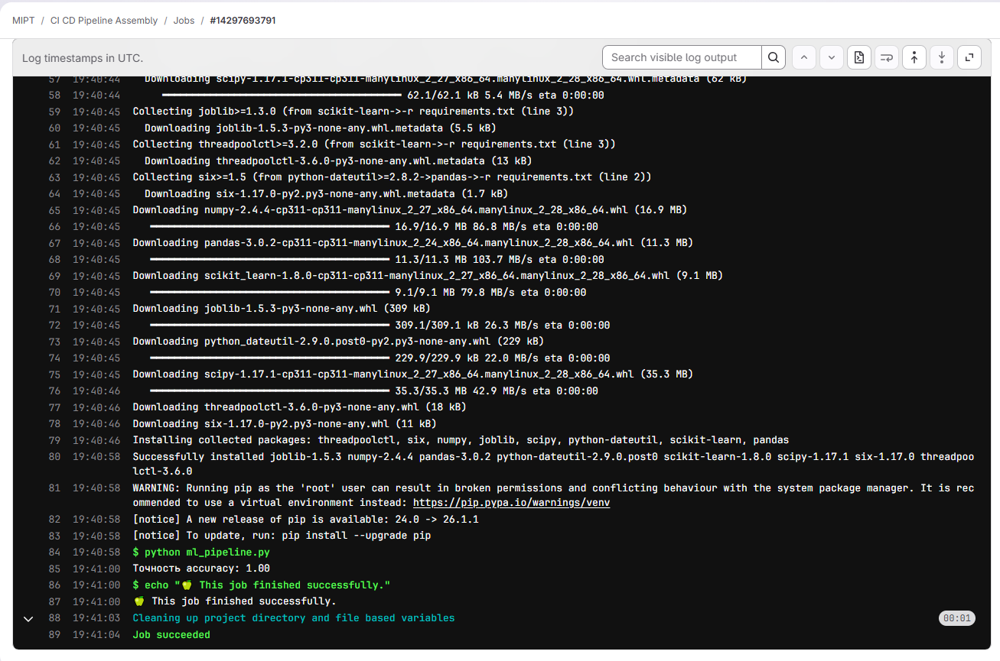
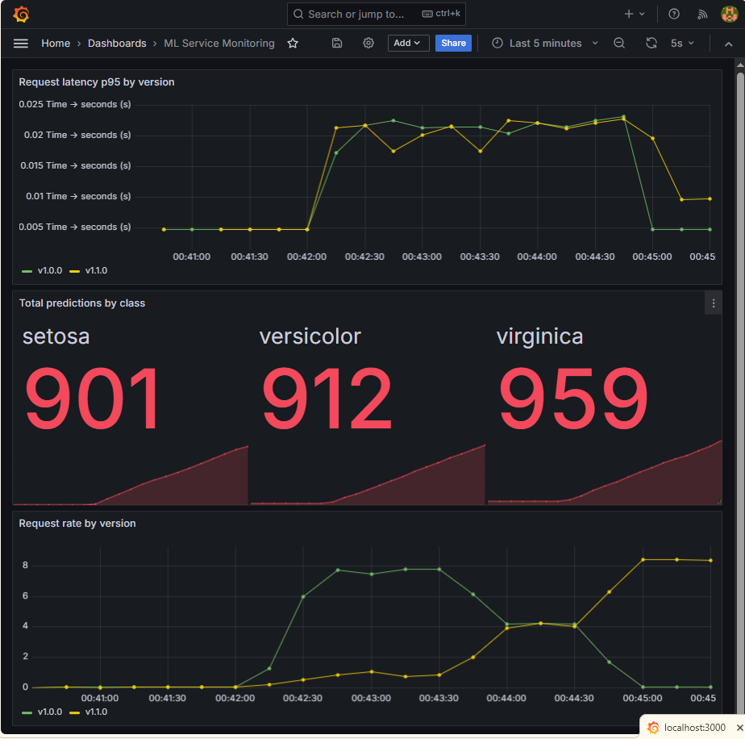

# HW7. CI/CD pipeline для ML-сервиса с canary deployment


Полный CI/CD-цикл для ML-сервиса на iris: обучение модели, публикация образа в GitHub Container Registry, canary deployment через nginx с переключением фаз 90/10, 50/50, 100%, и мониторинг в Prometheus + Grafana.

## Что внутри

| Слой | Технология | Файл |
|---|---|---|
| ML-модель | scikit-learn RandomForest | `ml_pipeline.py` |
| API-сервис | Flask + gunicorn | `app.py` |
| Контейнеризация | python:3.11-slim, non-root, healthcheck | `Dockerfile` |
| Canary routing | nginx с weighted upstream | `nginx/*.conf` |
| Оркестрация | Docker Compose | `docker-compose.canary.yml` |
| CI | GitHub Actions (тренировка + артефакты) | `.github/workflows/ci.yml` |
| Deploy | GitHub Actions (билд + push GHCR + smoke test) | `.github/workflows/deploy.yml` |
| Тренировка в CI | GitLab CI | `.gitlab-ci.yml` |
| Метрики | prometheus-flask-exporter | в `app.py` |
| Мониторинг | Prometheus + Grafana | `docker-compose.monitoring.yml` |

## Быстрый старт

Локальная сборка и запуск стека вместе с мониторингом:

```bash
docker build -t ml-service:v1.0.0 .
docker compose -f docker-compose.canary.yml -f docker-compose.monitoring.yml up -d
```

Проверка через единую точку входа (nginx на порту 8090):

```bash
curl http://localhost:8090/health
# {"status":"ok","version":"v1.0.0"}

curl -X POST http://localhost:8090/predict \
  -H "Content-Type: application/json" \
  -d '{"x":[5.1,3.5,1.4,0.2]}'
# {"status":"ok","version":"v1.0.0","prediction":0,"class_name":"setosa"}
```

UI и порты:

- Сервис через nginx: `http://localhost:8090`
- Prometheus: `http://localhost:9090`
- Grafana: `http://localhost:3000` (admin / admin)

## Стратегия деплоя: Canary

Выбрана Canary, а не Blue-Green. Причина: в исходном коде сервиса нет обработки ошибок, поэтому мгновенное переключение всего трафика на новую версию (Blue-Green) рискованно. Canary ограничивает потенциальный ущерб 10% пользователей в начале раскатки и дает время заметить регрессию до полного rollout.

Полное архитектурное решение со сравнением четырех стратегий (Blue-Green, Canary, Rolling, Shadow) в формате ADR лежит в ноутбуке `HW7_CICD_Вайс_ФС.ipynb`.

### Переключение фаз

Фазы canary переключаются через переменную окружения `NGINX_CONFIG`. Каждое переключение пересоздает только nginx-контейнер за 3-5 секунд, ML-сервисы и стек мониторинга работают непрерывно.

```bash
# Старт по умолчанию (90/10)
docker compose -f docker-compose.canary.yml -f docker-compose.monitoring.yml up -d

# Постепенный rollout до 50/50
set NGINX_CONFIG=nginx.50-50.conf
docker compose -f docker-compose.canary.yml -f docker-compose.monitoring.yml up -d

# Полный rollout
set NGINX_CONFIG=nginx.100.conf
docker compose -f docker-compose.canary.yml -f docker-compose.monitoring.yml up -d

# Rollback на стабильную версию
set NGINX_CONFIG=nginx.rollback.conf
docker compose -f docker-compose.canary.yml -f docker-compose.monitoring.yml up -d
```

Изначально пробовал переключать конфиги на лету через `docker cp` или `tee` без пересоздания контейнера. На Windows Docker Desktop этот подход работает нестабильно: запись в bind-mounted файл из контейнера через прослойку WSL2/NTFS дает случайные сбои с ошибкой `unlinkat: device or resource busy`. Пересоздание контейнера снимает проблему полностью.

Проверка распределения трафика по версиям:

```bash
python scripts/check_canary.py 100
```

Скрипт делает 100 запросов на `/health` через nginx и считает, сколько ответов пришло от какой версии.

## CI/CD pipelines

### GitHub Actions

Два workflow в `.github/workflows/`. Оба триггерятся на push в main.

**`ci.yml`** делает обучение и валидацию артефактов:

1. Setup Python 3.11 с кешированием pip.
2. Установка зависимостей из `requirements.txt`.
3. Запуск `ml_pipeline.py`, который сохраняет на диск `model.pkl`, `hyperparameters.json`, `metrics.json`.
4. Шаг "Make pipeline reproducible" реально валидирует наличие всех трех файлов и печатает версию модели и accuracy. Это переписанная версия шага из шаблона ДЗ: вместо `print` с риторическим вопросом теперь реальная проверка артефактов.
5. Upload-artifact на 30 дней.

**`deploy.yml`** делает сборку образа и smoke test:

1. Валидация наличия секрета `CLOUD_TOKEN`.
2. Приведение имени образа к нижнему регистру (GHCR требует lowercase, а `${{ github.repository }}` сохраняет регистр username).
3. Build через docker/buildx и push в `ghcr.io/theodorweiss/ml-model-deployment-hw7` с тегами `latest` и `${{ github.sha }}`.
4. Запуск контейнера прямо в CI с переменной `MODEL_VERSION` из секрета.
5. Smoke test тремя curl: `/health` должен вернуть 200, `/predict` с валидным входом возвращает прогноз, `/predict` с тремя признаками вместо четырех возвращает 400.

Секреты в репозитории: `MODEL_VERSION`, `CLOUD_TOKEN`.

### GitLab CI

`.gitlab-ci.yml` запускает `ml_pipeline.py` в чистом python:3.11-slim окружении и проверяет, что код тренировки модели завершается без ошибок в воспроизводимом окружении.



## Мониторинг

`prometheus-flask-exporter` автоматически экспортирует HTTP-метрики (`flask_http_request_total`, `flask_http_request_duration_seconds`). Дополнительно в `app.py` определен кастомный counter `predictions_total` с label `class_name`, который инкрементируется в успешной ветке `/predict`.

Prometheus скрапит обе версии сервиса раз в 5 секунд. В scrape config для каждого target добавлен label `version` со значением `v1.0.0` или `v1.1.0`. Prometheus прикрепляет этот label ко всем метрикам с этого target автоматически, что позволяет в Grafana делать запросы вида `sum by (version) (...)` без модификации app-кода.

Grafana подключается к Prometheus автоматически (datasource подгружается из `grafana/provisioning/datasources/`). Дашборд создается в UI с тремя панелями:

| Панель | PromQL |
|---|---|
| Request rate by version | `sum by (version) (rate(flask_http_request_total[30s]))` |
| Total predictions by class | `sum by (class_name) (predictions_total)` |
| Latency p95 by version | `histogram_quantile(0.95, sum by (le, version) (rate(flask_http_request_duration_seconds_bucket[30s])))` |



На скриншоте три фазы переключения canary за пять минут:

- `00:42:00 ... 00:43:30`: зеленая (v1.0.0) на 7-8 req/s, желтая (v1.1.0) на 1 req/s. Это фаза 90/10.
- `00:43:30 ... 00:44:30`: линии сходятся к 4 req/s каждая. Переключение на 50/50.
- `00:45:00 ... 00:46:00`: зеленая падает к нулю, желтая поднимается к 8 req/s. Полный rollout 100% на новую версию.

Обе версии показывают близкую латентность под нагрузкой (около 20мс p95). Это подтверждает, что Prometheus реально собирает метрики с обеих версий сервиса, а не только с активной.

## Структура проекта

```
.
├── .github/workflows/
│   ├── ci.yml                       # тренировка + артефакты
│   └── deploy.yml                   # билд + push GHCR + smoke test
├── doc/screenshots/                 # доказательные скриншоты
├── grafana/provisioning/            # автопровиженинг Prometheus datasource
├── nginx/
│   ├── nginx.90-10.conf             # начальная фаза canary
│   ├── nginx.50-50.conf             # промежуточная
│   ├── nginx.100.conf               # полный rollout
│   └── nginx.rollback.conf          # откат на стабильную версию
├── prometheus/
│   └── prometheus.yml               # scrape configs с label version
├── scripts/
│   ├── check_canary.py              # проверка распределения трафика
│   └── load_traffic.py              # генератор нагрузки на /predict
├── app.py                           # Flask с /health, /predict, /metrics
├── ml_pipeline.py                   # обучение + сохранение артефактов
├── Dockerfile                       # python:3.11-slim + gunicorn (non-root)
├── docker-compose.canary.yml        # 2 версии сервиса + nginx
├── docker-compose.monitoring.yml    # Prometheus + Grafana
├── requirements.txt
├── .gitlab-ci.yml                   # GitLab CI
└── HW7_CICD_Вайс_ФС.ipynb           # отчетный ноутбук
```

## Образ

Pull готового образа из GHCR:

```bash
docker pull ghcr.io/theodorweiss/ml-model-deployment-hw7:latest
```

Запуск standalone (без canary-стека):

```bash
docker run --rm -p 8000:8000 -e MODEL_VERSION=v1.1.0 \
  ghcr.io/theodorweiss/ml-model-deployment-hw7:latest
```
